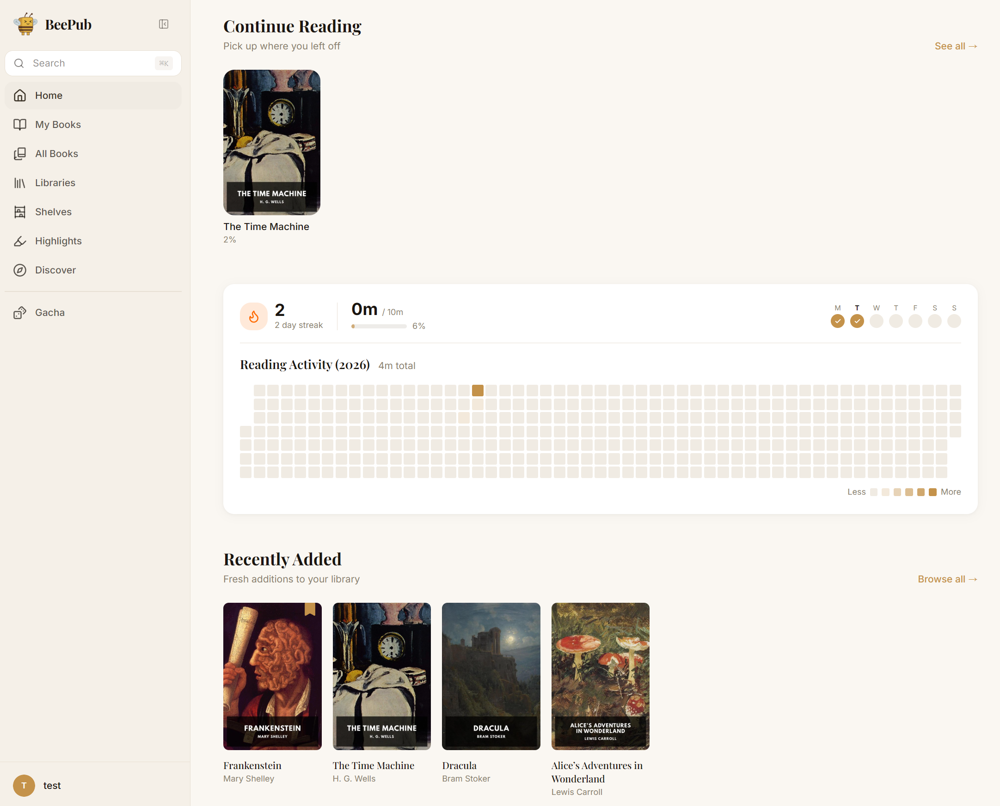
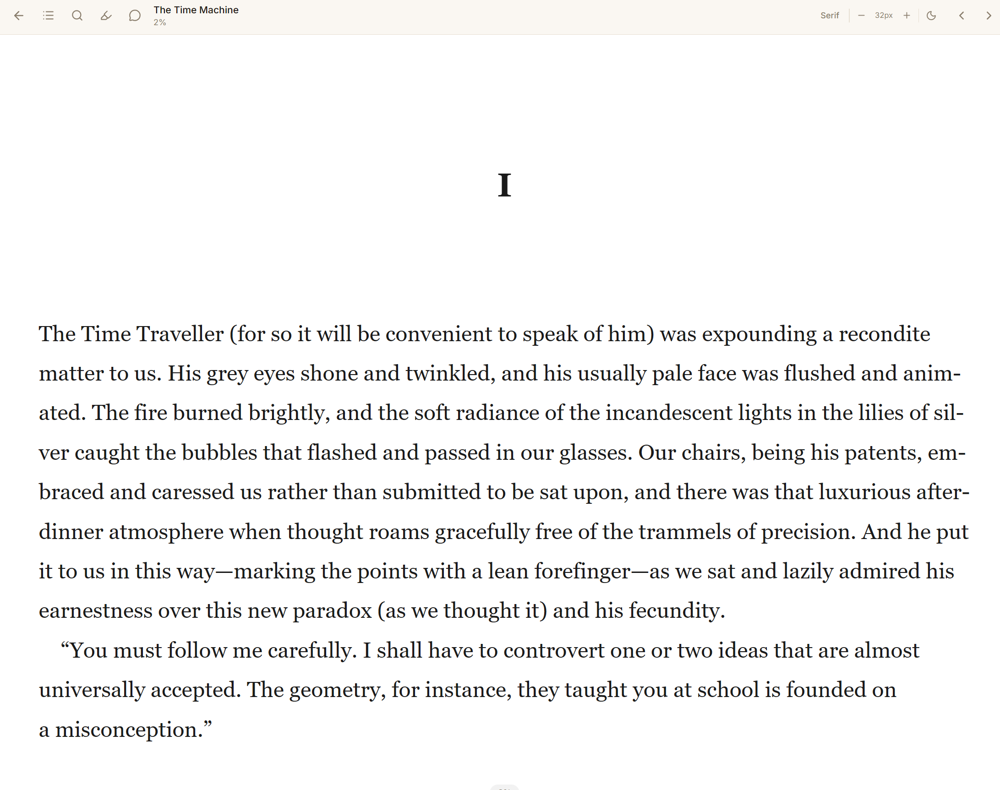

# BeePub

<p align="center">
  
</p>

BeePub is a self-hosted ebook library and reader for EPUB collections. It can
serve as a modern alternative to calibre-web, while also working as a standalone
library for users who do not run Calibre. BeePub combines library management, a
web reader, an iOS native app built with Capacitor, reading progress,
highlights, tags, metadata tools, and optional AI-assisted features in one
private deployment.





## Features

- Web reader with progress tracking, highlights, notes, table of contents, and
  mobile-friendly reading controls
- iOS native app support through Capacitor
- Offline reading for downloaded books
- Automatic reading activity tracking, streaks
- Gacha-style random book pulls for choosing what to read next
- Metadata lookup from external book sources
- Optional AI features for tagging, summaries, companion chat, illustrations,
  semantic search, and similar-book recommendations
- PostgreSQL with pgvector for semantic search support

## Quick Start

Copy the example environment file and set real secrets:

```bash
cp .env.example .env
openssl rand -hex 32
```

Edit `.env` and replace at least:

```env
POSTGRES_PASSWORD=replace-me
SECRET_KEY=replace-me-with-openssl-output
```

Start the full stack:

```bash
docker compose up -d --build
```

By default the app is served through nginx on:

```text
http://localhost
```

If you change `PORT` in `.env`, use that port instead.

### Reverse Proxy

For a domain-based deployment behind Traefik, Caddy, nginx, or another reverse
proxy, keep `BACKEND_URL` pointed at the internal Docker service and set
SvelteKit's public origin for the frontend:

```yaml
services:
  frontend:
    environment:
      ORIGIN: https://reader.example.com
      BACKEND_URL: http://backend:8000
```

`BACKEND_URL` is used only by the frontend server for internal server-side API
calls. Browser requests still go through the public origin and nginx's `/api`
proxy.

## Configuration

The main deployment settings live in `.env`.

Important variables:

- `POSTGRES_DB`, `POSTGRES_USER`, `POSTGRES_PASSWORD`: PostgreSQL database
  settings
- `SECRET_KEY`: JWT signing secret; generate a strong random value
- `PORT`: public nginx port
- `CORS_ORIGINS`: comma-separated public origins allowed to call the API;
  localhost browser origins on any port are always allowed
- `LOG_FORMAT`: `console` or `json`

API keys for optional AI and metadata providers are configured from the admin
settings UI after setup.

## Development

```bash
docker compose -f docker-compose.yml -f docker-compose.dev.yml up --build
```

Run backend tests:

```bash
cd backend
uv run pytest
```

Run frontend checks:

```bash
cd frontend
pnpm format
pnpm check
```

## Data And Backups

Docker Compose stores runtime data in named volumes:

- `postgres_data`: database
- `redis_data`: Redis state
- `books_data`: uploaded/imported books
- `covers_data`: extracted covers
- `illustrations_data`: generated illustrations

Back up these volumes before upgrading or rebuilding a production deployment.
The repository does not include book files, database contents, user data, API
keys, or generated runtime assets.

## License

BeePub is licensed under the GNU Affero General Public License v3.0 or later.
See [LICENSE](LICENSE).

The backend currently includes vendored EbookLib-derived code, which is licensed
under AGPLv3-or-later. The frontend uses epub.js, which is BSD-2-Clause
licensed.
