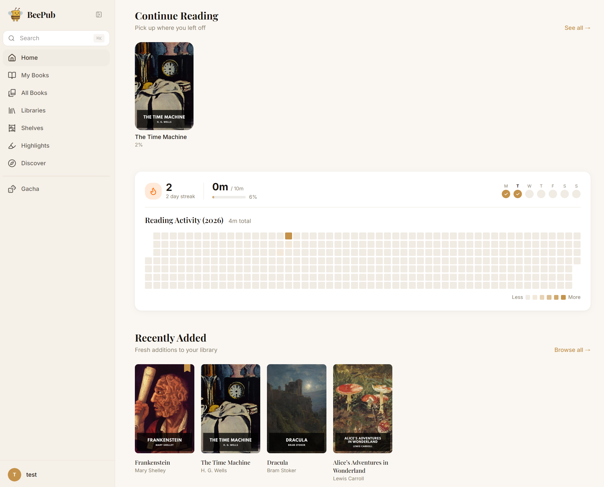
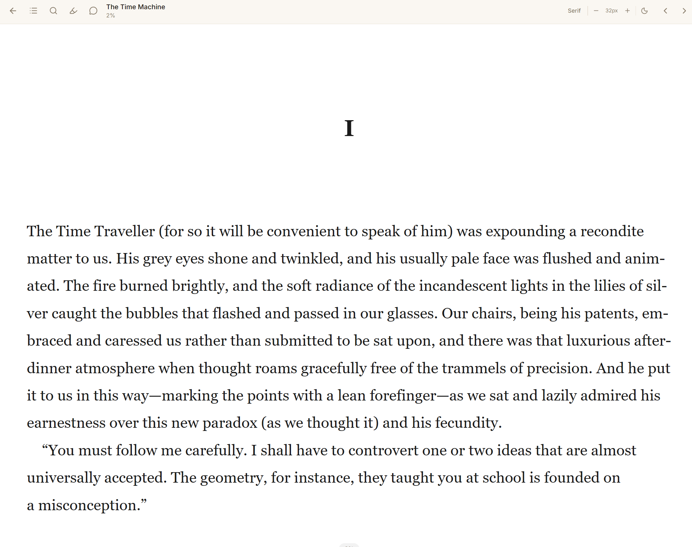

# BeePub

<p align="center">
  
</p>

BeePub is a self-hosted ebook library and reader for EPUB collections. It can
serve as a modern alternative to calibre-web, while also working as a standalone
library for users who do not run Calibre. BeePub combines library management, a
web reader, an iOS native app built with Capacitor, reading progress,
highlights, tags, metadata tools, and optional AI-assisted features in one
private deployment.





## Features

- Web reader with progress tracking, highlights, notes, table of contents, and
  mobile-friendly reading controls
- iOS native app support through Capacitor
- Offline reading for downloaded books
- Automatic reading activity tracking, streaks
- Gacha-style random book pulls for choosing what to read next
- Metadata lookup from external book sources
- Optional AI features for tagging, summaries, companion chat, illustrations,
  semantic search, and similar-book recommendations
- PostgreSQL with pgvector for semantic search support

## Quick Start

One file, one command — no required configuration. All services run from
prebuilt multi-arch (amd64/arm64) images on GHCR; nothing is built locally.

```bash
mkdir beepub && cd beepub
curl -LO https://raw.githubusercontent.com/oalieno/beepub/main/docker-compose.yml
docker compose up -d
```

Open `http://localhost` and register — the first account automatically
becomes the admin. A JWT secret is auto-generated on first start and
persisted in the `app_data` volume; the database is only reachable inside
the compose network.

Using Portainer, Synology Container Manager, or another compose UI? Paste
`docker-compose.yml` as the stack definition — it references no other local
files.

To customize (port, secrets, version pinning), download the example env file
next to the compose file and uncomment what you need:

```bash
curl -Lo .env https://raw.githubusercontent.com/oalieno/beepub/main/.env.example
```

To pin a release instead of tracking `latest`, set `BEEPUB_VERSION=0.1.0` in
`.env`. To upgrade later:

```bash
docker compose pull && docker compose up -d
```

### Building From Source

Clone the repository and add `--build` — every service also carries a build
context, so the same compose file builds the images locally instead of
pulling:

```bash
git clone https://github.com/oalieno/beepub.git && cd beepub
docker compose up -d --build
```

### Importing A Calibre Library

Coming from calibre-web? Mount your Calibre library (the folder containing
`metadata.db`) read-only into the `backend` and `worker` services — both
have a commented-out line ready in `docker-compose.yml`:

```yaml
    volumes:
      # ...existing volumes...
      - /path/to/calibre:/calibre:ro
```

Restart the stack, open **Admin → Calibre** in the app, and import the
library it finds. Books are read in place from the mount — BeePub never
writes to your Calibre library — and a periodic sync picks up books you add
or change in Calibre later. To serve several libraries, mount each one as a
subfolder of `/calibre`.

### Reverse Proxy

For a domain-based deployment behind Traefik, Caddy, nginx, or another reverse
proxy, keep `BACKEND_URL` pointed at the internal Docker service and set
SvelteKit's public origin for the frontend:

```yaml
services:
  frontend:
    environment:
      ORIGIN: https://reader.example.com
      BACKEND_URL: http://backend:8000
```

`BACKEND_URL` is used only by the frontend server for internal server-side API
calls. Browser requests still go through the public origin and nginx's `/api`
proxy.

## Configuration

The main deployment settings live in `.env`.

Important variables:

- `POSTGRES_DB`, `POSTGRES_USER`, `POSTGRES_PASSWORD`: PostgreSQL database
  settings; the database is not reachable from outside the compose network,
  so the defaults are safe to keep
- `SECRET_KEY`: JWT signing secret; auto-generated and persisted in the
  `app_data` volume when unset. Set it explicitly to control or rotate it —
  changing it logs every session out
- `PORT`: public nginx port
- `CORS_ORIGINS`: comma-separated public origins allowed to call the API;
  localhost browser origins on any port are always allowed
- `LOG_FORMAT`: `console` or `json`

API keys for optional AI and metadata providers are configured from the admin
settings UI after setup.

## Development

```bash
docker compose -f docker-compose.yml -f docker-compose.dev.yml up --build
```

Run backend tests:

```bash
cd backend
uv run pytest
```

Run frontend checks:

```bash
cd frontend
pnpm format
pnpm check
```

## Data And Backups

Docker Compose stores runtime data in named volumes:

- `postgres_data`: database
- `redis_data`: Redis state
- `books_data`: uploaded/imported books
- `covers_data`: extracted covers
- `illustrations_data`: generated illustrations

Back up these volumes before upgrading or rebuilding a production deployment.
The repository does not include book files, database contents, user data, API
keys, or generated runtime assets.

## License

BeePub is licensed under the GNU Affero General Public License v3.0 or later.
See [LICENSE](LICENSE).

The backend currently includes vendored EbookLib-derived code, which is licensed
under AGPLv3-or-later. The frontend uses epub.js, which is BSD-2-Clause
licensed.
